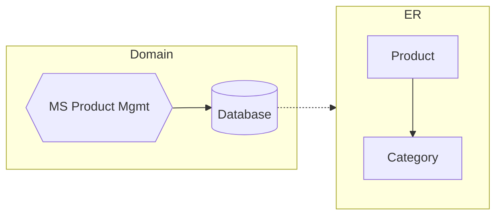
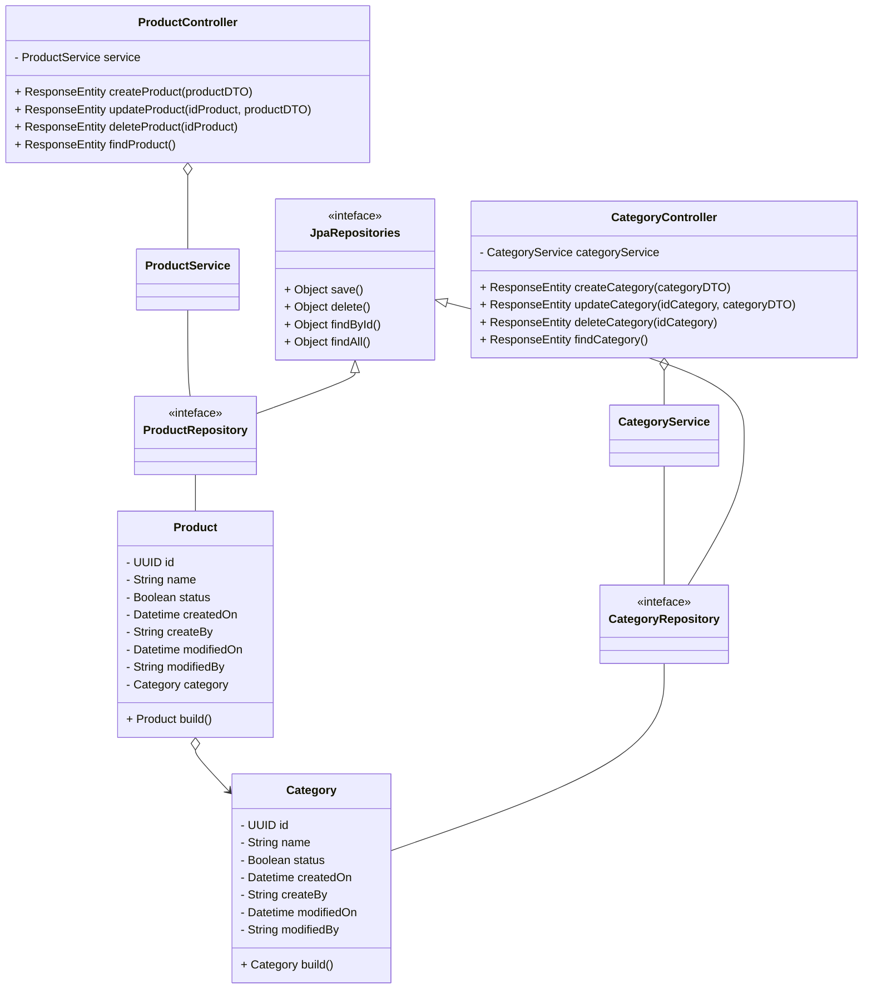

# Product Management Microservice
##### _v 1.0.0_
<i style="font-size:14px">  </i>

### **1. Description**

This is an application responsible for maintaining a product database. 

- #### Tecnologies and Frameworks
    | | JDK 17|
    |---|---|
    | | `v 3.0.6` |

### **2. Use Case**
- Maintain the product registration in its own database, and allow registration operations, consultation, change of records.

### **3. Class Diagram**
- Below is an example model of the organization of microservice classes. 

