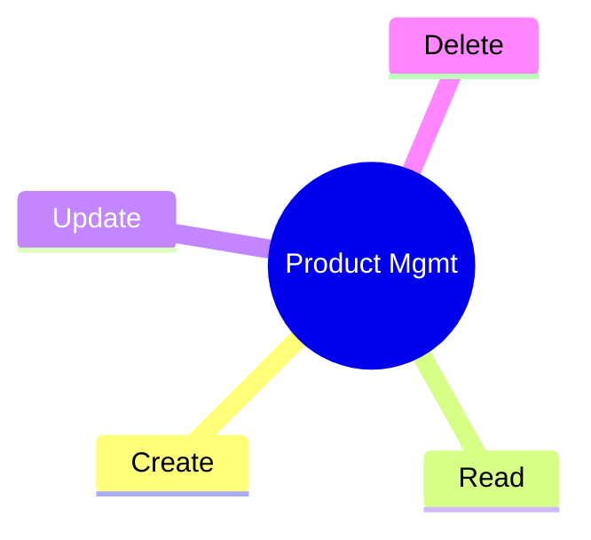

# Product Management Microservice
##### _v 1.0.0_
<i style="font-size:14px">  </i>


### **1. Description**

This is an application responsible for maintaining a product database. 

- #### Tecnologies and Frameworks
    | | JDK 17|
    |---|---|
    | | `v 3.0.6` |


### **2. Use Case**
- Manter o cadastro de produtos em uma base de dados própria, e possibilite as operações de cadastro, consulta, alteração de registros. 




### **3. Entity Relationship**
```mermaid
---
title: Product Catalog Management
---
erDiagram
    PRODUCT ||--|| CATEGORY : contains
    PRODUCT {
        uuid id
        string name
        boolean status
        datetime created_on
        string created_by
        datetime modified_on
        string created_by
    }
    CATEGORY {
        uuid id
        string name
        boolean status
        datetime created_on
        string created_by
        datetime modified_on
        string created_by
    }