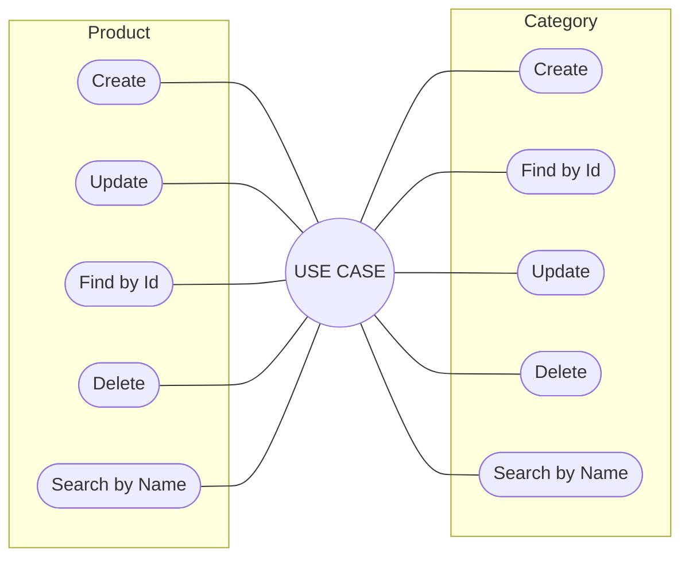

# Product Catalog Management
##### _v 1.0.0_
<i style="font-size:14px">  </i>

### **1. Description**

This is an application responsible for maintaining a product database. 

- #### Tecnologies and Frameworks
    | | JDK 17|
    |---|---|
    | | `v 3.0.6` |

### **2. Use Case**
- Maintain the product registration in its own database, and allow registration operations, consultation, change of records.

#### 2.1 Compoments

#### 2.2 Entity Relationship

[Mermaid](https://mermaid.live/edit#pako:eNrNUsFqwzAM_RXhc33Z0beRlh3GaMjaw4YhaLaXmiZycO1BSPLvc5q2W8sGO042yNLTk2VLPVNOGyYY51xSsKE2AlYFcMi901EFyDBg7Sp4QsLKNIaCpGOw8UuLlcdGEiTJ7jerh3XxAsPA-dBDXqyX22xTXvwClKOAlg4z4RQAfyJM6-qWfrYnidFqSDt__PJ9oFc79HdA2BjYfkM0BgPKm6R06egHyhl8625YsZ3UhTRev-PfVVT--lnt3NvS6htApWyV890FSRnZgjXGN2h1GpNjJsnCLk2CZCIdNfq9ZJLGFIcxuOeOFBPBR7Ngc3mnMWHiHetD8rZIr86d7fETT8jFAg)

### **3. Class Diagram**
- Below is an example model of the organization of microservice classes. 

